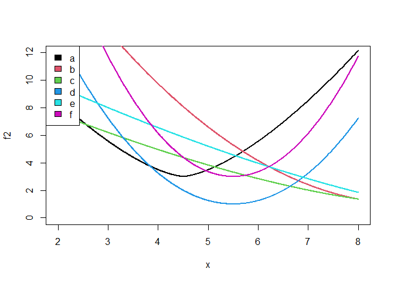
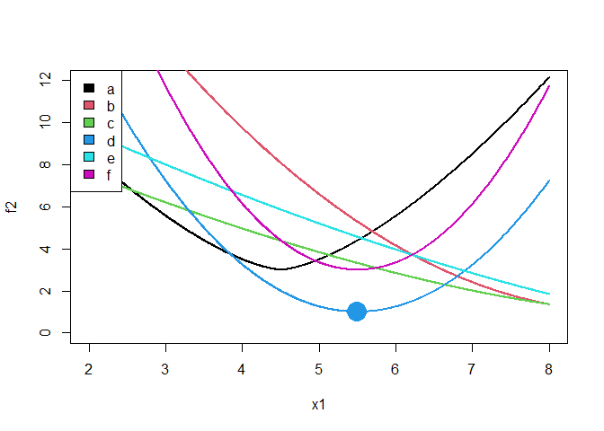

<!-- README.md is generated from README.Rmd. Please edit that file -->

# mixopt

<!-- badges: start -->
<!-- badges: end -->

**An R package for mixed variable nonlinear optimization**

The goal of mixopt is to optimize nonlinear functions that have mixed
variable inputs. Both local and global optimization are available.

## Installation

You can install the development version of mixopt from
[GitHub](https://github.com/) with:

``` r
# install.packages("devtools")
devtools::install_github("CollinErickson/mixopt")
```

## Examples

Load the package with the following:

``` r
library(mixopt)
```

### Example: coordinate descent for local minimization

Suppose you have a function, called `f2`, that takes in two arguments.
The first is a continuous numeric value between 2 and 8. The second is a
discrete factor that can on the values ‘a’, ‘b’, ‘c’, ‘d’, ‘e’, or ‘f’.

The six lines shown below are how the function varies when varying the
first parameter while leaving the second at one of the levels, as
indicated in the legend.



To run coordinate descent on this function, we will use
`mixopt_coorddesc` and need to specify the possible values for the
inputs. To specify a continuous variable from 2 to 8, we use
`mopar_cts(2,8)`. To specify our discrete variable, we can use
`mopar_unordered("a", "b", "c", "d", "e", "f")`. For this function,
unordered means that there is no ordering over the six factor options.

We call the function as follows. Note that we have to put our parameter
ranges/values in a list and pass it in to `par`, and the function gets
passed in to the argument `fn`.

``` r
# Run the optimizer
out <- mixopt_coorddesc(
  par=list(
    mopar_cts(2,8),
    mopar_unordered(letters[1:6])
  ),
  fn=f2,
  verbose=0
)

# Print the result
# par is the parameter values
# val is the function value at the minimum
out
#> $par
#> $par[[1]]
#> [1] 5.5
#> 
#> $par[[2]]
#> [1] "d"
#> 
#> 
#> $val
#> [1] 1
#> 
#> $counts
#> function gradient 
#>       25       NA 
#> 
#> $runtime
#> Time difference of 0.002318144 secs
```

The output from the optimizer tells the value, the parameter values, the
number of function evaluations made, and the time it took.

The large dot shows where the optimizer ends when using
`mixopt_coorddesc`. On this problem, it is very likely to get stuck in a
local minimum on the right side since it is doing coordinate descent. We
could get better results using a global optimization method.


